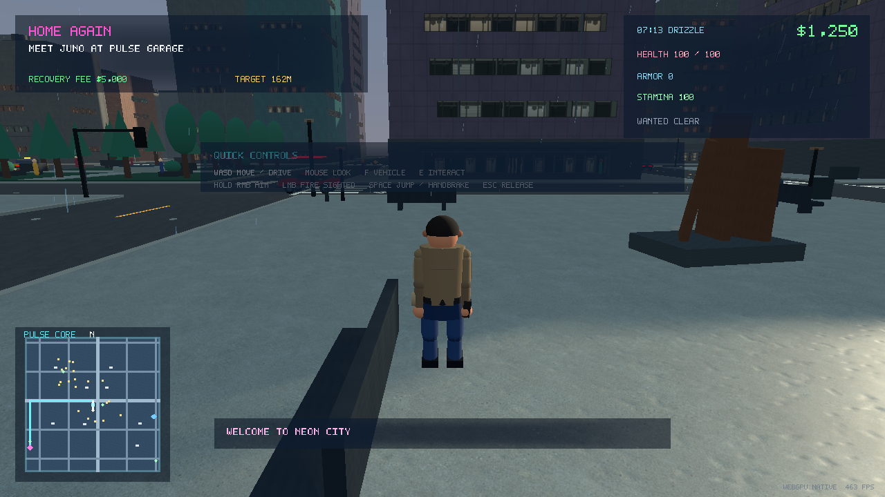

# GTA Neon City: Home Again / Borrowed Time / The Night Count

GTA Neon City is a playable, GTA-inspired open-world action and city-life
vertical slice for the WebView-free ThreeBrowserRuntime. It runs as JavaScript
inside a native Windows Vulkan/WebGPU window—not a browser—and contains no
sample-specific C++.



## Play it

Launch the staged Runtime build with:

```powershell
pwsh -NoProfile -ExecutionPolicy Bypass -File `
  C:\ThreeBrowser\ThreeBrowserRuntime\samples\gta_neon_city\play.ps1
```

The direct equivalent is:

```powershell
pwsh -NoProfile -ExecutionPolicy Bypass -File `
  C:\ThreeBrowser\ThreeBrowserRuntime\run.ps1 `
  C:\ThreeBrowser\ThreeBrowserRuntime\samples\gta_neon_city\site-entry.mjs
```

Always launch `site-entry.mjs`, not `src\main.mjs`. Its sibling
`threebrowser.pull.json` tells the native host to install WebGPU before the game
module loads. JavaScript-only edits do not require rebuilding the Runtime.

Startup deliberately creates every gameplay, cinematic, first-person weapon,
weather, HUD and lighting pipeline before the title becomes interactive. That
cache exists only in memory and is recreated on every launch; the first right
click during play should therefore not incur a shader compilation stall.
The warmup is reduced to the two render formats the game actually owns: one
reveal-all world pass and one reveal-all HUD pass. A native verification run on
the development machine completes both passes in roughly 9.5 seconds and
reaches READY in roughly 13.3 seconds, down from a measured 20.7-second pipeline
phase and 24.6-second READY. The passes compile through their real reveal-all
renders rather than Three's interactive `compileAsync` path, which yields once
per render item and unnecessarily frame-paces thousands of startup-only items.
The same pass walks ordinary PBR slots and nested node-material graphs, verifies
that every authored bitmap, generated normal/roughness layer, virtual interior,
font, black HUD backing and minimap source is decoded, then explicitly uploads
each texture before its real warm render. Texture and pipeline preparation are
memory-only; diagnostics reject missing sources or any disk-cache policy.

A 600-step startup micro-simulation also exercises storm, pursuit, occupied
police-car, blood, ragdoll, all three named Night Shift taxi fares and their
dialogue/cabin transitions, the complete ambient-roadside state vocabulary,
made/missed basketball-flight, every Open Doors
menu/meal/acknowledgement branch, and all eleven Borrowed Time sequences. The
Chapter Two pass touches its 47 dialogue lines, three clues, both Chapter One
histories, both costly decisions, both aftermath hooks and both human
epilogues before restoring the locked initial state. The simulation then
restores the world and clears every effect. A separate renderer-free pass
genuinely begins, steps and completes
the lawful Pulse Line shuttle and both mutually exclusive aftermath routes—15
destination, dwell and interaction stops in total—then restores the live
activity state bit-for-bit. It also completes both moral branches, all 44 lines,
eight simulated survey stops and six aftermath tasks of The Night Count, while
a renderer-backed presentation check borrows and releases the four named route
participants before READY. Both warmups are RAM-only.

Click the game window once to capture the cursor. `Escape` releases it; click
again to resume.

## Controls

- `WASD` / arrow keys — move on foot or drive
- mouse — look with the stable world-up third-person camera
- mouse wheel or `C` — change third-person camera distance
- hold right mouse — draw the pistol and enter true first-person iron sights
- left mouse — fire only while right mouse is held
- `Shift` — sprint on foot
- `Space` — jump on foot or use the handbrake while driving; also advance dialogue
- `E` — talk, advance dialogue, inspect evidence, use an activity objective, start a nearby job/story, or open a business
- `F` — enter or leave the nearest vehicle; close an open shop menu
- `W` / `S`, then `E` — choose and buy from an open shop menu; `Q` closes it
- `R` — reload; `Q` — melee
- `H` — horn
- `M` — begin or replay the current garage chapter, or start The Night Count when its Southline meeting is available
- `A` / `1` or `D` / `2` — make the active story's evidence decision when prompted
- `P` — pause
- `K` / `L` — quick-save / quick-load
- `T` — respawn after being wasted
- `Escape` — release cursor capture

The Runtime reserves `Shift+Tab` for its feature panel and `F3` for its FPS
overlay.

## Chapter One: Home Again

Kai Mercer comes back to Neon City to help his sister Juno keep their family
garage alive. Rin has evidence that developer Adrian Voss is using forged
seizure orders to squeeze honest neighbourhood businesses. The opening is an
authored cinematic sequence with establishing shots, character close-ups,
camera-owned cuts and skippable dialogue.

Walk to Pulse Garage and speak to Juno. The first job is not an anonymous car
theft: Marisol's legally registered Comet has been taken by Voss's private
impound crew, and its dash contains an audit drive. Recover the customer's car,
avoid hurting anyone, lose the corrupt flag and return the vehicle intact. The
resolution does not hand Kai a clean answer. Publishing immediately stops the
contract vote while exposing people Voss coerced; sealing the source list keeps
them safe while Voss continues operating. Both choices have a written
consequence scene, a persistent moral ledger and a different playable aftermath
job in free roam.

Juno and Rin are named, protected story actors with distinct faces, clothing
and roles. Pulse Garage is a proper workshop set with open service bays,
canopy lighting, office glazing and a safe pedestrian forecourt instead of a
conversation marker sitting in traffic.

## Chapter Two: Borrowed Time

Borrowed Time unlocks after Home Again's decision and remembers which promise
Kai made there. Leah Moreno, a night-care driver and Pulse customer, survives a
brake failure. Juno admits that she saw a supplier-code mismatch but accepted
the parts while the garage had only $600 left. Kai inspects the failed hose,
supplier invoice and unedited service log, hears Leah's account at Common
Ground, then follows the batch to Southline Parts Depot. Dara Ibarra, the
depot's clerk and union steward, helps him establish that eleven serviced cars
received relabelled stock under Voss's authorization.

The choice is about timing, not a clean good ending. **Report now** protects the
evidence and starts a public recall, but exposes eleven people, suspends Pulse
for 30 days and leaves Southline workers without shifts. **Recall, then report**
lets Kai and Juno call the seven known owners first, but four unidentified
drivers remain at risk while Voss gets six hours to move the original manifest;
Pulse is still suspended. Each decision has a distinct consequence scene,
moral ledger and free-roam aftermath rather than a reward screen.

Completing that aftermath returns to the people behind the ledger. At the
public recall desk, Mara Velez explains that the notice protected her body but
also attached her name to an employer's fraud. At Southline, Dara can turn one
carbon copy into Arturo Reyes while three rows stay blank. Neither scene erases
the branch's cost, reopens Pulse, or turns accountability into a victory lap.
Both are physically staged with named actors and preallocated paperwork, save
mid-line exactly, and play only once.

## Ordinary story: The Night Count

The Night Count is a full, nonviolent story earned through living in the city,
not a campaign gate or a cash pickup. Complete two city-life activities, finish
one Night Shift fare, and become familiar enough with Rosa's Southline Diner.
Then meet Rosa with `M` or `E`. Malik Reed's night-bus validator failed, making
cash riders disappear from the city's evidence just as an annual audit decides
whether the route survives. Kai drives the legitimate Pulse Line and stops
fully at four existing route anchors to count riders without recording their
private working lives.

The audit accepts two imperfect files. Anonymous counts protect every rider's
schedule, but secure only sixty trial nights, cut two late runs, and leave eight
hours of weekly counting to neighbours. Five informed affidavits preserve the
full timetable for a year, while the riders' employer bands and travel windows
become public contract evidence. Neither is labelled the correct ending. The
chosen cost remains in a durable moral ledger and leads to three different
aftermath tasks plus a human epilogue.

Rosa remains her existing protected diner keeper. Malik, auditor Evelyn Cho,
hospital porter Desmond Vale and laundry worker Nadiya Khoury borrow four
ordinary pedestrians already rendered during startup; blocking diner scenes
stage them for authored camera coverage, route conversations stay non-blocking,
and completion or load returns the exact identities and routines. The story
adds no payout, population node, runtime asset, or first-use pipeline. Save
schema v7 preserves the precise line, branch, public/privacy ledger, pending
events and borrowed actor identities.

The final diner shots also remain gameplay-state honest: the parked Pulse Line
keeps its exact transform, occupants, ownership and save data while only its
precomputed drawables are omitted from the synchronous cinematic render. Its
resident light nodes stay in Three's active-light graph, with their intensities
set to zero for that render and restored in `finally`. This removes the camera
occluder and floating headlight spill without creating the multi-second pipeline
rebuild caused by hiding an entire light-owning vehicle root.

## Things to do in the city

Free roam is not built only around stealing or fighting. Nine repeatable jobs
and activities are branch-independent. The authored catalog contains 13
activities in total: a completed two-chapter playthrough exposes 11 because
one Home Again aftermath and one Borrowed Time aftermath are unlocked while
their alternatives remain mutually exclusive. The Night Count sits above that
catalog as a one-time ordinary-life story whose unlock proves those systems
matter beyond earning money:

- **Pulse Parcels** — drive a work van and deliver repaired parts and community orders
- **City Lens** — photograph the harbour, park fountain and North Market mural on foot
- **Pulse Park 5K** — run a timed, marked park circuit
- **Neighbourhood Hands** — clean and report damaged public spaces
- **Pulse Roadside** — take the legitimate service van to stranded drivers, then exit and repair each fault on foot
- **Pulse Line** — drive the marked community minibus west along Street 04, stopping fully for five accessibility boarding dwells
- **Night Shift Stories** — collect Samira, Tomas or Inez; each passenger has a job, a reason for travelling, route conversation, collision reaction and branch-aware view of Kai's earlier choices
- **Harbour Loop** — run an ordered checkpoint time trial in a sports car
- **Harbour Court** — play a five-shot timing round from two- and three-point positions on foot
- **Safe Passage** — after publishing, move records and help the coerced sources Kai exposed
- **Paper Trail** — after protecting the sources, document the new harm Voss causes during the delay
- **The Open Ledger** — after reporting the defect immediately, use the service van to support a public recall while grounded owners and suspended workers absorb its cost
- **The Missing Four** — after recalling first, trace fleet records and preserve evidence on foot while four unidentified drivers remain at risk and Voss uses the delay

The peaceful activities pay money and neighbourhood trust. They have authored
hubs, route guidance, objectives, completion states and save/restore support.
Harbour Court owns one preallocated ball, a visible release meter and five
authored shot positions; saving during a shot restores the exact ball flight.
Traffic, crosswalk pedestrians, social groups, horns, storefronts and weather
continue running during every activity.

Night Shift Stories keeps one person continuous from the pavement to the rear
seat and back onto the pavement. The named curb actor is borrowed from the
existing population, hidden only while the already-created cabin passenger is
visible, then restored to the exact identity, routine and position they had
before the fare. Dialogue is non-blocking, appears over an opaque black-backed
card, saves mid-line and never takes camera or input ownership. Safe and rough
arrivals have different final lines rather than being reduced to a grade.

Pulse Roadside also runs independently as an ambient city service. A calm
nearby civilian phones in a breakdown or serious collision; an existing car
stops with hazards, and the nearest of two occupied service vans drives a
street-grid route to it,
repairs it and returns both vehicles and the observer to ordinary simulation.
Reporter selection uses a deterministic one-block (48 m) radius and leaves the
borrowed resident at their real pavement position while they face the incident.
The witness, held car, drivers, eight amber beacons and both responders all
exist at startup—nothing is spawned when the incident begins.

## Open Doors neighbourhood routine

Four usable businesses make earned money part of ordinary city life instead of
only a score. Asha Patel runs Common Ground Cafe from 06:00–18:00, Mina Okafor
runs Mina's Market Kitchen from 07:00–21:00, Kenji Sato keeps Harbour Lantern
open from 17:00–03:00, and Rosa Alvarez serves Southline Diner from 20:00–06:00.
Each keeper is a named, protected person standing at a collision-checked counter
or threshold—not an anonymous menu floating over an empty shop.

Every business has three authored meals or drinks plus a fourth option to pay a
meal forward. Food can restore health and stamina and raises a gentle appetite
state; appetite only changes idle stamina recovery, so ignoring it never damages
or kills Kai and does not turn the game into a survival chore. Familiarity rises
at most once per in-game day. Keeper lines respond to the hour, rain, the active
story and Kai's evidence decision. Paying forward gives no stat or trust reward;
return on a later day and the keeper tells Kai that the meal reached someone.

The routine is independent of the one-at-a-time job system, persists exact menu,
meal, appetite, familiarity and pay-forward state in quick-saves, and uses one
fixed preallocated GPU panel. All four menu variants and their consumption and
acknowledgement states are exercised during the same RAM-only startup warmup.
Common Ground, Harbour Lantern and Southline Diner also have pooled physical
frontages—dark room-box glazing, counters, shelves, seating, service fixtures
and opening-hour practical lights—rather than existing only as map prompts.

## Day, night and occupied buildings

One full game day takes 24 real minutes, so every game minute advances in one
real second. The environment uses a temperate southern-coast solar path rather
than putting the sun directly overhead. Sunrise, golden hour, sunset, civil
twilight and night continuously drive the sky, fog, exposure, sunlight,
moonlight, stars, wet-road response and shadow direction.

Forty-eight street, plaza and promenade practicals, two cool Harbour Court
floodlights, three warm North Market pendants, three warm garage canopy lights,
fifteen selected occupied-shop entrance pools, two Southline yard/work pools,
two bounded Pulse Street Exchange downlights and three usable-business frontage
lights fade on at dusk and shut completely off during daylight. That is 78
local practical light pools (80 static lights including ambience and moonlight)
before moving vehicle lights.
Every moving vehicle has visible headlamps, brake and tail lamps plus a bounded,
shadow-free low-beam road pool. Office occupancy varies by floor and time instead
of turning whole towers into neon boxes.

The 2048² celestial shadow map follows the controlled character or vehicle in
a texel-snapped 168 m local volume. This roughly doubles nearby shadow density
without changing the light set or rebuilding the shadow projection during
play, so feet, cars and street furniture retain sharper contact with the ground.

The tower glazing uses the same room-box illusion seen in large city games:
view-dependent projected fake depth places dark glass in front of interior
walls, lit and unlit offices, blinds, desks, partitions and occasional
silhouettes. It reads as rooms behind a façade while remaining cheap enough for
the native city. Forty-seven former 4.1 m generic podiums are now 0.82 m
rain-darkened PBR plinths, so 60 of 61 buildings expose 240 four-sided occupied
ground-floor room banks at walking height. That street-level correction reuses
the same 64 batches and 5,535 static instances. Neon is concentrated on signs
and street accents.

Concrete/stone façade families combine their procedural normal and roughness
maps with bundled weathered coastal-concrete and salt-aged panel-stone albedos.
The latter is a separately authored high-resolution, brand-free surface for the
three façade families that previously relied only on procedural colour. Westside and North
Market add a separate aged-brick albedo with a matching deterministic staggered
brick normal/roughness profile. The road and pavement use their own authored
1024² worn-asphalt and exposed-aggregate albedos. Harbour Court adds a fifth
authored 1024² salt-worn painted-surface albedo and its own procedural normal
and roughness profile. Southline adds a sixth authored 1024² corrugated-steel
albedo over a deterministic metal normal/roughness layer, giving its depot a
distinct coastal-industrial skin. All seven are awaited through the native virtual URL
before world creation, use repeated mipmaps and anisotropic filtering, and fall
back to the deterministic procedural surfaces if a bitmap is unavailable. These are PBR
raster materials; the sample does not mislabel them as hardware ray tracing.

Rain changes materials rather than only adding particles: dry asphalt is
rough, puddles nearly disappear, and clear-weather lane paint receives normal
lighting. As rain builds, asphalt, curbs and pavement lose roughness, puddle
opacity rises, and real headlights stretch across the wet surface.

The deterministic map has five districts, 61 authored buildings, 15 road
corridors, 30 traffic routes, exactly 5,535 batched static instances, 44
recessed storefronts, 1,938 varied window banks, puddles and 59 distant light
points across the skyline. Street furniture, buildings, planters and trees
participate in the same collision and camera-obstruction system.

Street level now also includes café tables and chairs, bins, parcel boxes,
parking meters and a complete waterfront court with painted markings, glass
backboard, steel support, rim, woven net, ball rack, spectator bench and two
floodlights. North Market has a coherent four-stall street arcade: shallow
weather roofs, counters, shelves, signs, glass displays, stacked goods and 60
grounded prop instances gather around safe visitor and keeper anchors under
three amber pendants. These additions reuse existing geometry, material and
instance pools; the full city remains within exactly 64 instanced batches.

Pulse Street Exchange turns the previously generic Street 04 shelter into a
real transit frontage: a recessed dark-glass room-box lobby, concrete canopy,
route boards, two ticket machines, five benches, a bike rack, painted dispatch
bay and two bounded warm practicals. Five dry and five covered waiting anchors
route existing commuters and students through the shelters at morning and
early-evening commute times; rain moves them under cover and midday disperses
the queue. Thirty-nine nearby parts replace 39 low-value distant room strips,
so the station adds no instanced batch or static-instance cost.

Southline Parts Depot is an authored investigation location rather than a
floating objective: a loading yard, manifest desk, suspect pallet, loading seal
and customer-vehicle bay establish four evidence anchors. Pulse Garage carries
the three matching physical clue positions and Leah has a safe conversation
anchor at Common Ground. A dedicated weathered corrugated facade breaks up the
warehouse's large street wall. Hose, clipboard, open-log and manifest pieces
now form ten readable pooled evidence parts, with 20 Southline prop parts in
total. Separate safe interaction marks keep Kai, Leah and Dara from occupying
the same physical point. Two clock-driven practical lights are retained
without increasing the 64-batch ceiling.

Thirty ambient civilians use a 953-point, collision-checked sidewalk graph
rather than cutting diagonally between a few remote spawn markers. Commuters,
market and harbour workers, students, joggers and nightlife regulars choose
destinations from the actual game clock. Rain shortens outdoor conversations,
quickens walking pace and raises prewarmed umbrellas. Backpacks, phones and
morning coffee add grounded individual variation. Together with Juno, Rin, the
four Open Doors keepers and the seven-officer response pool, the native
simulation also includes Leah Moreno, Dara Ibarra and recall customer Mara
Velez, and maintains 46 authored people. Two additional hidden civilian reserves
are rendered during startup but do not join the population until claimed; this
keeps development or gameplay spawns from constructing a new actor hierarchy
mid-frame. The Night Count borrows four of the existing 30 ambient residents
for Malik, Evelyn, Desmond and Nadiya, then restores their exact identities,
positions, routes, accessories and weather behaviour; the public count remains
46 throughout the story.
Nearby pedestrians keep their full articulated rigs; distant pedestrians use
a two-mesh full-body silhouette LOD that retains legs and the umbrella canopy
in rain. Both representations share the same grounded 0.015–1.902 m body
envelope, fixing the former 30–53 cm pavement hover without reallocating a LOD
node. This keeps the crowded view readable while protecting first-person aiming performance.

Nineteen vehicles use sprung-body physics. One existing vehicle slot is now the
authorized Pulse Line minibus, with a visible driver, three passenger
silhouettes and fixed route-panel, glazing and door parts. Traffic follows signals, queues,
predicts gaps and reverses out of real obstructions. Civilians socialize, use
signalled crosswalks, avoid cars and yield to horns. A pooled police response
uses sightlines, flanking, controlled bursts and finite magazines without
turning ordinary free roam into automatic hostility. Every responding cruiser
has a visible driver and partner rather than arriving empty. Ordinary moving
cars have visible precreated drivers, a deterministic subset carries a front
passenger, the taxi exposes its named rear passenger, and both Pulse Roadside
vans have civilian drivers and four pooled amber beacons each. Severe pedestrian
and vehicle impacts enter a bounded articulated ragdoll, and human hits use
preallocated blood droplets and persistent dark ground stains; none of those
effects allocates a new mesh during play.

## Rendering and persistence

The frame owns one native surface and performs exactly one swap-chain present.
Third-person, cinematic and first-person modes share that presenter, removing
the former double-render path. The first-person weapon is a separate,
memory-prewarmed viewmodel; holding right mouse switches camera ownership
without rebuilding renderer state.
If a tree, pole or corner would collapse the ordinary chase shot below 3.2 m,
the camera probes three preallocated rear-quarter alternatives and briefly
holds the clearest legal branch to prevent popping. Fully boxed-in spaces still
use the nearest valid clip, mouse orbit remains authoritative and ADS bypasses
the fallback entirely.

The district minimap uses one fixed 196² in-memory texture backed by a
preallocated byte buffer. Roads, the cyan navigation route, traffic,
pedestrians, police, peaceful-activity hubs, four clock-aware business markers
and mission/player markers update at 20 Hz while the world and camera remain
uncapped. Its pixel storage is reused; no map mesh or bitmap is created during
play. HUD text presentation refreshes at 30 Hz and entity/minimap data at
20 Hz; input, simulation, camera motion and 3D rendering remain full-rate.
One-shot keyboard and mouse edges are retained for up to 240 ms or twelve
simulation ticks and are consumed exactly once. Render-only frames no longer
erase `E`, `F`, story choices or mouse-look deltas before the 60 Hz simulation
can see them; blur and pointer-lock loss still cancel stale physical input.

Every HUD text mesh also owns fixed-capacity position, UV and index buffers
created at startup. Updating a prompt, subtitle, objective, shop line or moral
choice rewrites those typed arrays and changes only the geometry draw range.
The attributes use static GPU usage and are marked dirty only when the string
actually changes, avoiding a full text-buffer upload on unchanged HUD frames.
Borrowed Time reuses the existing fixed mission, dialogue and choice fields, so
revealing its longest line cannot allocate a new glyph mesh or compile a new
mid-game pipeline.

Pipeline compilation is **RAM-only**. It does not use a disk shader cache.
The player headlight objects remain in a stable scene-light set and switch off
with zero intensity. The external twin-lamp rig owns the active player throw:
its softer 38 m cones are capped at 330 intensity each in clear weather, with
only an eight-percent wet-road boost, so nearby PBR surfaces retain detail.
This avoids invalidating Three.js render-object caches when the player first
aims. Two hidden pedestrian reserves are likewise included in
the reveal-all pass. In the current fresh native verification, all 37 discovered
world/HUD textures were source-ready and explicitly uploaded before READY. The
latest repeated performance pass reached READY after a 9.23-second pipeline
phase; its first ADS control round trip was 23.7 ms, dry baseline peaked at
13.3 ms, the aim window at 12.6 ms and the combined
night/rain/police/blood/ragdoll window at 25.9 ms, with zero
frames over 50 ms. These are named-pipe evidence rather than a promised
hardware-independent frame rate.
Quick-saves are ordinary player-requested save data. Save schema v7 preserves
Borrowed Time's exact phase, dialogue line, clue set, evidence method, decision,
moral ledger and aftermath unlock alongside The Night Count's exact route line,
choice, consequence ledger and borrowed actor identities, plus businesses,
activities, named taxi dialogue and any active ambient roadside response. Saves
from versions 1–6 remain accepted; missing later-story state is initialized
safely from its locked state. Synthesized audio
may be cached under `%LOCALAPPDATA%\ThreeBrowser\GtaNeonCity\audio-v2`; that
storage is unrelated to graphics pipelines.

The procedural audio mix includes separate daytime traffic/bird and nighttime
urban/insect beds. They crossfade from the game clock, duck inside a moving
vehicle and yield to heavy rain.

World audio uses startup-generated, channel-isolated stereo WAV pairs because
the native runtime intentionally does not expose a Web Audio panner. Seventy
native elements are opened and awaited before `READY`: fixed voice pools cover
gunshots, impacts, horns, footsteps, melee and thunder, while one police-siren
pair starts silently and follows the nearest occupied police car. Equal-power
gains follow the resolved gameplay, ADS or cinematic camera, and inverse
distance falloff makes remote events quieter and eventually inaudible. UI,
mission, pickup, radio and taxi-cabin cues remain non-positional. Native
diagnostics verify that element and load counts remain 70/70 during play with
zero runtime audio allocation or source loads.

## Fast deterministic tests

These tests do not open a window:

```powershell
node --test `
  C:\ThreeBrowser\ThreeBrowserRuntime\samples\gta_neon_city\tests\*.test.mjs
```

The suite covers all three story state machines and cinematic cameras, every
costly decision branch and aftermath unlock, peaceful life activities, taxi work,
racing, Harbour Court basketball, Open Doors purchases, appetite, familiarity
and pay-forward continuity, 24-hour solar/light transitions, room-box
materials, the Southline evidence set, single-surface presentation, RAM-only
renderer and simulation warmup, fixed-capacity HUD glyph buffers, first- and
third-person cameras, aim-only shooting, player animation, vehicle dynamics,
occupied ordinary traffic, named passenger staging, autonomous roadside
response, grounded full/distant pedestrian LOD, local pedestrian navigation, clock-driven routines, weather props,
collision, wanted response, HUD routing and save-v7 migration contracts. Pulse
Street Exchange coverage also verifies the pooled frontage, lawful minibus,
commuter rain behavior, accessibility dwells, exact partial-shift restoration
and RAM-only route warmup. Asset-readiness coverage proves that all seven
authored bitmaps are valid, decoded before world creation, and that gameplay
modules own no late bitmap loader; renderer tests prove generated PBR maps,
virtual rooms, the font, black backing and minimap are explicitly uploaded.
The current deterministic suite passes **197/197**
tests. The command above is
the source of truth after future integration changes.

## Real native play-tests

The native harness drives the actual Vulkan/WebGPU game through a sample-owned
Windows named pipe. It uses no browser automation. In terminal one:

```powershell
$env:THREEBROWSER_GTA_CONTROL_PIPE='\\.\pipe\ThreeBrowserGtaNeonCityTest'
pwsh -NoProfile -ExecutionPolicy Bypass -File `
  C:\ThreeBrowser\ThreeBrowserRuntime\run.ps1 `
  C:\ThreeBrowser\ThreeBrowserRuntime\samples\gta_neon_city\site-entry.mjs
```

In terminal two, run the full live simulation and optional GPU readback:

```powershell
node `
  C:\ThreeBrowser\ThreeBrowserRuntime\samples\gta_neon_city\tests\live-playtest.mjs `
  '\\.\pipe\ThreeBrowserGtaNeonCityTest' `
  C:\ThreeBrowser\artifacts\gta-neon-city-playtest.png
```

For focused visual evidence, the story/light and camera harnesses write native
PNG captures:

```powershell
node C:\ThreeBrowser\ThreeBrowserRuntime\samples\gta_neon_city\tests\native-story-life-qa.mjs `
  '\\.\pipe\ThreeBrowserGtaNeonCityTest' C:\ThreeBrowser\artifacts\gta-neon-story-lighting

node C:\ThreeBrowser\ThreeBrowserRuntime\samples\gta_neon_city\tests\native-camera-qa.mjs `
  '\\.\pipe\ThreeBrowserGtaNeonCityTest' `
  C:\ThreeBrowser\artifacts\gta-neon-third-person.png `
  C:\ThreeBrowser\artifacts\gta-neon-iron-sights.png

node C:\ThreeBrowser\ThreeBrowserRuntime\samples\gta_neon_city\tests\native-realism-qa.mjs `
  '\\.\pipe\ThreeBrowserGtaNeonCityTest' C:\ThreeBrowser\artifacts\gta-neon-realism

node C:\ThreeBrowser\ThreeBrowserRuntime\samples\gta_neon_city\tests\native-performance-qa.mjs `
  '\\.\pipe\ThreeBrowserGtaNeonCityTest'

node C:\ThreeBrowser\ThreeBrowserRuntime\samples\gta_neon_city\tests\native-spatial-audio-qa.mjs `
  '\\.\pipe\ThreeBrowserGtaNeonCityTest'

node C:\ThreeBrowser\ThreeBrowserRuntime\samples\gta_neon_city\tests\native-input-qa.mjs `
  '\\.\pipe\ThreeBrowserGtaNeonCityTest'

node C:\ThreeBrowser\ThreeBrowserRuntime\samples\gta_neon_city\tests\native-basketball-qa.mjs `
  '\\.\pipe\ThreeBrowserGtaNeonCityTest' C:\ThreeBrowser\artifacts\gta-neon-harbour-court

node C:\ThreeBrowser\ThreeBrowserRuntime\samples\gta_neon_city\tests\native-business-qa.mjs `
  '\\.\pipe\ThreeBrowserGtaNeonCityTest' C:\ThreeBrowser\artifacts\gta-neon-open-doors

node C:\ThreeBrowser\ThreeBrowserRuntime\samples\gta_neon_city\tests\native-borrowed-time-qa.mjs `
  '\\.\pipe\ThreeBrowserGtaNeonCityTest' C:\ThreeBrowser\artifacts\gta-neon-borrowed-time recall-first

node C:\ThreeBrowser\ThreeBrowserRuntime\samples\gta_neon_city\tests\native-night-shift-roadside-qa.mjs `
  '\\.\pipe\ThreeBrowserGtaNeonCityTest' C:\ThreeBrowser\artifacts\gta-neon-night-shift-roadside

node C:\ThreeBrowser\ThreeBrowserRuntime\samples\gta_neon_city\tests\native-night-route-qa.mjs `
  '\\.\pipe\ThreeBrowserGtaNeonCityTest' C:\ThreeBrowser\artifacts\gta-neon-night-count
```

The control protocol supports `ping`, `snapshot`, `action`, `key`, `aim`,
`look`, `render`, `advance`, `teleport`, `vehicle`, `enterVehicle`,
`exitVehicle`, `startMission`, `startTaxi`, `startRace`, `startLife`,
`startBasketball`, `startNightRoute`, `startChapterTwo`, `startCurrentChapter`,
`story`, `chapterTwo`, `nightRoute`, `activity`, `cancelActivity`, `setWanted`, `roadside`,
`neighbourhood`, `openBusiness`, `shopSelect`, `shopBuy`, `closeBusiness`,
`clearWanted`, `setWeather`,
`setTime`, `resetFrameTiming`, `fire`, `shootAt`, `face`, `damage`, `spawnPed`, `save`, `restore`,
`writeSave`, `loadSave`, `screenshot` and `dispose`.

## Export for another player

Package the sample as a self-contained Windows application:

```powershell
dotnet run --project C:\ThreeBrowser\ThreeBrowserRuntime\ThreeBrowserRuntime.csproj -- export `
  C:\ThreeBrowser\ThreeBrowserRuntime\samples\gta_neon_city `
  --name "GTA Neon City" `
  --output C:\ThreeBrowser\artifacts\gta-neon-city-export `
  --mode portable
```

Use `--mode single` for one embedded executable. A recipient of either export
does not need Node or .NET installed.

## Structure

- `src/world/city.mjs`, `surface-textures.mjs` — districts, projected interiors, PBR surfaces, routes and collision
- `assets/textures/*.png` — seven bundled authored albedos, including salt-aged panel stone and Southline's corrugated-steel cladding, with procedural PBR fallbacks
- `src/actors/vehicles.mjs` — driving, traffic, pursuit and practical vehicle lighting
- `src/actors/player.mjs`, `first-person-weapon.mjs` — third-person movement and first-person aim viewmodel
- `src/actors/population.mjs` — story cast, civilians, witnesses and tactical police
- `src/game/story.mjs`, `chapter-two.mjs`, `night-route.mjs`, `cinematics.mjs` — two campaign chapters, the ordinary-life Night Count, persistent moral branches and camera direction
- `src/game/life-activities.mjs`, `activities.mjs`, `basketball.mjs` — peaceful work, Pulse Line, taxi, time-trial, Harbour Court and four mutually exclusive story aftermaths
- `src/game/neighbourhood-routine.mjs` — clock-driven businesses, appetite, familiarity, meals and pay-forward continuity
- `src/game/roadside-response.mjs` — deterministic ambient reports, dispatch, repair, clearing and save continuity
- `src/game/environment.mjs` — solar cycle, rain, sky, clock, lighting and atmosphere
- `src/core/pipeline-warmup.mjs` — startup-only memory pipeline preparation
- `src/ui/hud.mjs` — native-rendered HUD, dialogue and district minimap
- `src/core/control-pipe.mjs` — native development and play-test interface
- `tests/chapter-two.test.mjs`, `native-borrowed-time-qa.mjs` — deterministic Borrowed Time coverage and native investigation/decision evidence
- `tests/night-route.test.mjs`, `native-night-route-qa.mjs` — both Night Count ledgers plus native unlock, route, cutscene, save/load and stable-identity evidence
- `tests/native-transit-qa.mjs` — native morning/rain/night exchange captures plus a complete five-stop no-stall shuttle proof
- `tests/neighbourhood-routine.test.mjs`, `native-business-qa.mjs` — deterministic routine coverage and native Open Doors evidence
- `tests/roadside-response.test.mjs`, `native-night-shift-roadside-qa.mjs` — deterministic and native taxi/roadside lifecycle evidence
